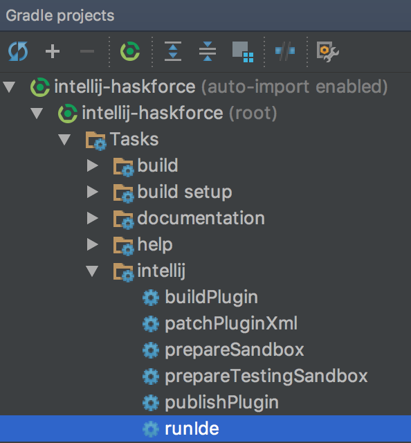

# HaskForce

[](https://travis-ci.org/carymrobbins/intellij-haskforce)
[](https://gitter.im/carymrobbins/intellij-haskforce?utm_source=badge&utm_medium=badge&utm_campaign=pr-badge&utm_content=badge)

## The IntelliJ plugin for Haskell.

Want to get started right away?  Check out the [Quick Start Guide](https://github.com/carymrobbins/intellij-haskforce/wiki/Quick-Start-Guide)!

## Getting involved

Want to contribute code?  See the [CONTRIBUTING](./CONTRIBUTING.md) doc for more info.

Follow [@HaskForce](https://twitter.com/haskforce) on Twitter to stay up to date
on new releases and work in progress.

Start a discussion on our [gitter channel](https://gitter.im/carymrobbins/intellij-haskforce).

Do you IRC?  Join **#haskforce** on freenode!

## Building

Clone the repo -

```
% git clone https://github.com/carymrobbins/intellij-haskforce
% cd intellij-haskforce
```

Build with Gradle -

```
% ./gradlew assemble
```

You can then find your plugin zip archive in `build/distributions` -

```
% ls build/distributions
```

## Running the plugin

You can use the `runIde` Gradle task from the command line or directly
from IntelliJ -



## Debugging the plugin

You can run the plugin as described above via IntelliJ to enable setting
breakpoints and stepping through code.

If you wish to debug the external builder (e.g. the `jps-plugin` sub-project),
you'll need to use the remote debugger.
See the [IntelliJ SDK DevGuide](http://www.jetbrains.org/intellij/sdk/docs/reference_guide/frameworks_and_external_apis/external_builder_api.html#debugging-a-plugin-for-external-builder)
for more info.

## Testing the plugin

You can run all tests using the standard Gradle task -

```
./gradlew test
```
